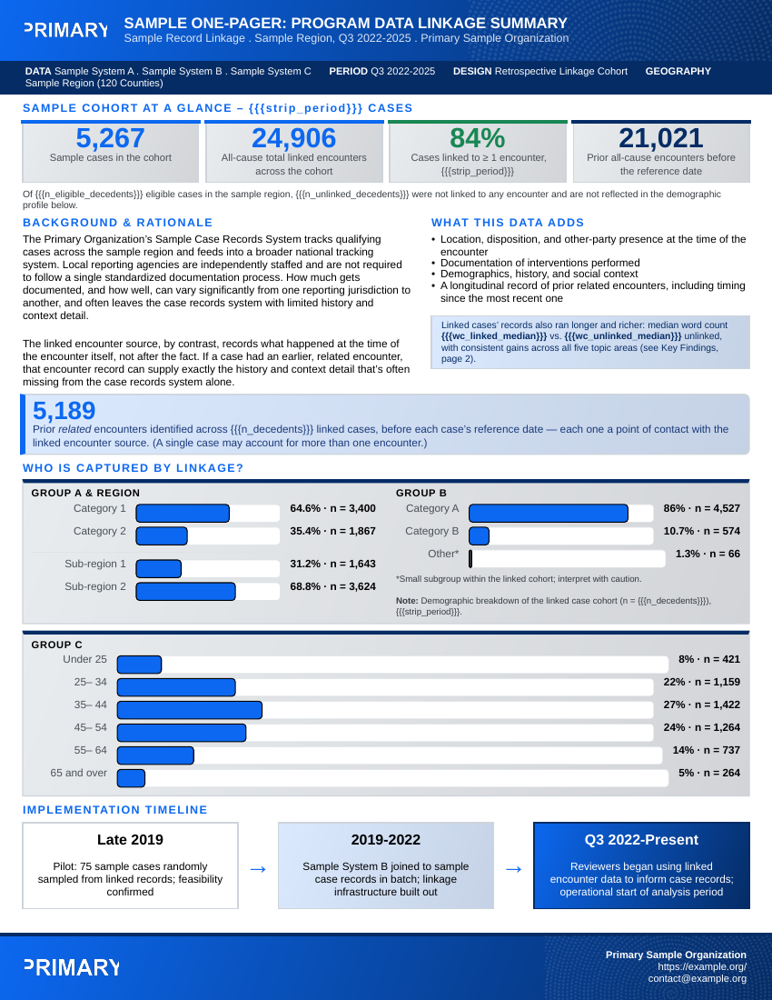

# Getting started with onepagr

onepagr turns a named list of values into a finished, accessible PDF
report using one of its built-in Typst templates. This vignette walks
through rendering your first report, picking a theme, and moving on to
customizing a template.

## Before you start

onepagr needs [Quarto](https://quarto.org) (which bundles Typst) on your
system. Check whether it’s available:

``` r

onepagr::check_quarto()
```

If that reports a problem, install a user-local copy yourself with
[`onepagr::install_quarto()`](https://andrew-farrey.github.io/onepagr/reference/install_quarto.md)
(onepagr never installs anything automatically) or install Quarto
normally from quarto.org, then restart your R session.

On macOS and Linux,
[`install_quarto()`](https://andrew-farrey.github.io/onepagr/reference/install_quarto.md)
also points onepagr at the copy it just installed: it sets `QUARTO_PATH`
for your current session right away, then asks whether to save that to
your `~/.Renviron` too, so every future session picks it up
automatically. You’re never expected to hand-edit a `.Renviron` file
yourself. (Windows opens the official installer instead, so there’s no
path to set until you finish that yourself.)

If you already have a Quarto install elsewhere onepagr should use
instead (an admin-managed one on Posit Workbench, for example),
`onepagr::set_quarto_path("/path/to/quarto")` points onepagr at it the
same way, with the same save-for-later prompt.

## Render your first report

Every template needs a named list of values, and which values depend on
the template.
[`template_data()`](https://andrew-farrey.github.io/onepagr/reference/template_data.md)
gives you a complete, working starting point for any built-in template:
every value is already filled in, a real one, not a blank you have to
guess the shape of.

``` r

library(onepagr)

data <- template_data("cohort_summary")
out <- tempfile(fileext = ".pdf")
render_onepager(
  data, template = "cohort_summary", theme = "default", output = out
)
file.exists(out)
#> [1] TRUE
```

That’s the whole workflow: a starter list, a finished PDF. `data` here
is the package’s own example data (see
[`example_data()`](https://andrew-farrey.github.io/onepagr/reference/example_data.md)),
so this renders exactly the PDF shown below in “What you get” without
changing a thing. A real project replaces the values it has real numbers
for:

``` r

data$n_decedents <- "6,000"
data$strip_period <- "2025"
# Every heading, label and paragraph keeps its default wording unless
# you set it too -- see vignette("theming"), Part 5.
```

`attr(data, "required")` names the entries
[`template_data()`](https://andrew-farrey.github.io/onepagr/reference/template_data.md)
had no default for – the ones a real project actually needs its own
numbers for, as opposed to wording you can leave alone:

``` r

attr(data, "required")
#>  [1] "contact_email"                   "logo_primary_path"              
#>  [3] "logo_primary_alt"                "org_full"                       
#>  [5] "contact_url"                     "doc_title"                      
#>  [7] "doc_subtitle"                    "strip_data"                     
#>  [9] "strip_period"                    "strip_design"                   
#> [11] "strip_geography"                 "n_decedents"                    
#> [13] "n_ems_total"                     "pct_linked"                     
#> [15] "n_prior_ems"                     "n_prior_od_ems"                 
#> [17] "pct_linked_male_width"           "n_male"                         
#> [19] "pct_linked_female_width"         "n_female"                       
#> [21] "pct_linked_appalachian_width"    "n_appalachian"                  
#> [23] "pct_linked_nonappalachian_width" "n_nonappalachian"               
#> [25] "pct_linked_white_width"          "n_white"                        
#> [27] "pct_linked_black_width"          "n_black"                        
#> [29] "pct_linked_other_width"          "n_other"                        
#> [31] "pct_linked_age_lt25_width"       "n_age_lt25"                     
#> [33] "pct_linked_age_25_34_width"      "n_age_25_34"                    
#> [35] "pct_linked_age_35_44_width"      "n_age_35_44"                    
#> [37] "pct_linked_age_45_54_width"      "n_age_45_54"                    
#> [39] "pct_linked_age_55_64_width"      "n_age_55_64"                    
#> [41] "pct_linked_age_65plus_width"     "n_age_65plus"                   
#> [43] "tl1_yr"                          "tl1_label"                      
#> [45] "tl2_yr"                          "tl2_label"                      
#> [47] "tl3_yr"                          "tl3_label"                      
#> [49] "pct_any_prior_enc"               "pct_od_prior_enc"               
#> [51] "pct_naloxone_width"              "pct_no_naloxone_width"          
#> [53] "pct_naloxone"                    "n_naloxone_enc"                 
#> [55] "pct_no_naloxone"                 "n_no_naloxone_enc"              
#> [57] "domain_diff_scene"               "domain_diff_history"            
#> [59] "domain_diff_drug"                "domain_diff_medication"         
#> [61] "domain_diff_mental"              "median_days"                    
#> [63] "mean_days"                       "pct_30d_width"                  
#> [65] "n_30d"                           "pct_90d_width"                  
#> [67] "n_90d"                           "pct_365d_width"                 
#> [69] "n_365d"                          "pct_gt365d_width"               
#> [71] "n_gt365d"                        "lessons_learned_text"           
#> [73] "disclaimer_text"                 "footnote_sources"               
#> [75] "n_od_ems_denom"                  "timing_denom"                   
#> [77] "n_eligible_decedents"            "n_unlinked_decedents"           
#> [79] "wc_linked_median"                "wc_unlinked_median"             
#> [81] "mean_prior_enc"                  "median_prior_enc"               
#> [83] "pct_decedent_nax"                "timing_iqr"
```

You’d typically build those values from your analysis output using
ordinary R ([`sprintf()`](https://rdrr.io/r/base/sprintf.html),
[`scales::comma()`](https://scales.r-lib.org/reference/comma.html),
[`paste()`](https://rdrr.io/r/base/paste.html)), the same way you’d
assemble any other report’s numbers – not hand-type them the way this
vignette’s example does.

## What you get

This is the actual PDF the
[`render_onepager()`](https://andrew-farrey.github.io/onepagr/reference/render_onepager.md)
call above produces (front page; `cohort_summary` is a fixed two-page
template, so a matching back page follows it in the real file):

    #> Warning in sprintf(filenames, pages, format): 2 arguments not used by format
    #> '/home/runner/work/onepagr/onepagr/docs/articles/getting-started_files/figure-html/unnamed-chunk-6-1.png'
    #> [1] "/home/runner/work/onepagr/onepagr/docs/articles/getting-started_files/figure-html/unnamed-chunk-6-1.png"



By default,
[`render_onepager()`](https://andrew-farrey.github.io/onepagr/reference/render_onepager.md)
leaves the resolved `.typ` source (and everything it needs to recompile:
the theme, shared components, and assets) next to your output PDF, in a
folder named after it, here something like `<tempfile>_typst/`. That’s
deliberate: the actual Typst source is never hidden, even if you never
open it. If you want only the PDF and nothing else, pass
`keep_typst = FALSE`.

## Picking a theme

onepagr ships three built-in themes, selectable by name:

``` r

render_onepager(data, template = "cohort_summary", theme = "default", output = "report.pdf")
render_onepager(data, template = "cohort_summary", theme = "uk", output = "report.pdf")
render_onepager(data, template = "cohort_summary", theme = "kdph", output = "report.pdf")
```

List what’s available:

``` r

onepagr::list_themes()
#> [1] "default" "kdph"    "uk"
```

Your own project can supply a fully custom theme instead. See
[`?resolve_theme`](https://andrew-farrey.github.io/onepagr/reference/resolve_theme.md)
for how `theme_path` works, and any file under
`system.file("typst/themes", package = "onepagr")` for the token schema
a custom theme needs to define.

## Exploring or customizing a template

To see a template’s real Typst source, or hand-edit one, export it into
your own project rather than reading it out of the installed package:

``` r

export_template("cohort_summary", "my-report/", theme = "uk")
```

That copies the template, the resolved theme, shared components, and
assets into `my-report/` as one self-contained, independently compilable
unit. Once exported, it’s yours: onepagr never touches it again. Compile
your edited copy directly with
[`compile_typst()`](https://andrew-farrey.github.io/onepagr/reference/compile_typst.md).

## What’s required for each template

Every template validates its input before compiling: if a required value
is missing,
[`render_onepager()`](https://andrew-farrey.github.io/onepagr/reference/render_onepager.md)
raises a clear R error listing exactly which ones, rather than silently
producing a PDF with a blank spot. You can check what a template needs
ahead of time:

``` r

onepagr::list_templates()
#> [1] "cohort_summary"       "county_choropleth"    "overdose_spike_alert"
#> [4] "syndromic_alert"      "trend_snapshot"
```

``` r

# Every token a template takes: required ones first, then optional ones
# with their default text.
head(onepagr::template_tokens("overdose_spike_alert"), 8)
#>               token required default
#> 1     contact_email     TRUE    <NA>
#> 2 logo_primary_path     TRUE    <NA>
#> 3  logo_primary_alt     TRUE    <NA>
#> 4          org_full     TRUE    <NA>
#> 5       contact_url     TRUE    <NA>
#> 6    severity_level     TRUE    <NA>
#> 7         doc_title     TRUE    <NA>
#> 8      doc_subtitle     TRUE    <NA>
```

The optional tokens are the template’s own wording (headings, captions,
paragraphs, labels). Set any of them in `data` to reword it; see
[`vignette("theming")`](https://andrew-farrey.github.io/onepagr/articles/theming.md),
Part 5.

``` r

# Path to a built-in template's source, if you want to read its {{{token}}} usage directly
onepagr::resolve_template("overdose_spike_alert")
```

## Learn more

- [`?render_onepager`](https://andrew-farrey.github.io/onepagr/reference/render_onepager.md),
  [`?export_template`](https://andrew-farrey.github.io/onepagr/reference/export_template.md),
  [`?compile_typst`](https://andrew-farrey.github.io/onepagr/reference/compile_typst.md)
  for the full function reference.
- [`?check_quarto`](https://andrew-farrey.github.io/onepagr/reference/check_quarto.md),
  [`?install_quarto`](https://andrew-farrey.github.io/onepagr/reference/install_quarto.md)
  for the Quarto/Typst toolchain helpers.
- The package README for the full list of built-in templates and their
  informational shapes.
